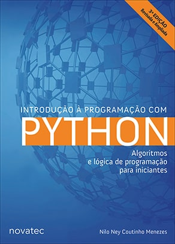

<h1 align="center">
	<strong>Exercícios do livro: <a href="https://python.nilo.pro.br/index.html">Introdução à Programação com Python - 3ª Edição</a> 📖🐍</strong>
</h1>

<!-- 

 -->

  

  

  

<!--  -->

## 📘 Sobre o livro

O livro aborda os conceitos básicos de programação, como expressões, variáveis, repetições, decisões, listas, dicionários, conjuntos, funções, arquivos, classes, objetos e banco de dados com SQLite 3, utilizando a linguagem [Python][python], sendo apresentados um a um com exemplos e exercícios. 
A obra visa explorar a programação de computadores como ferramenta do dia a dia.

* **Título:** [Introdução à Programação com Python](https://www.novatec.com.br/livros/introducao-python-3ed/) 
* **Autor:** [Nilo Ney Coutinho Menezes](https://www.nilo.pro.br/) 
* **Edição:** Terceira 
* **Editora:** [Novatec](https://novatec.com.br/) 
* **Ano:** 2019 

## 📋 Sumário

Acesse o [**sumário em PDF**](https://s3.novatec.com.br/sumarios/sumario-9788575227183.pdf) do livro.
## 💡 Motivação

Repositório criado para estudos e registro das atividades.

## 📃 Licença

O repositório está sob a licença [MIT][mit]. Consulte o arquivo [LICENSE](https://github.com/bryan-lima/exercicios-livro-introd-prog-python-3ed/blob/master/LICENSE) para obter mais detalhes.

[python]: https://www.python.org/
[mit]: https://opensource.org/licenses/MIT